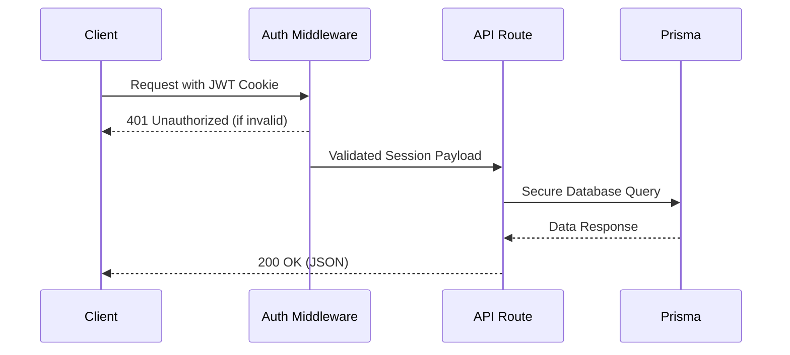

# rivaResolve — API Documentation Reference

This reference document outlines the RESTful endpoints, request/response formats, authorization layers, and validation rules for **rivaResolve**.

All relative API endpoints are prefixed with `/api`.

### API Flow Architecture


---

## 1. Authentication APIs

### 1.1 Register Student/Staff
Creates a new account and assigns it the default `STUDENT_STAFF` role.
*   **Endpoint:** `POST /api/auth/register`
*   **Headers:** `Content-Type: application/json`
*   **Request Body:**
    ```json
    {
      "name": "Obi Student",
      "institutionalId": "RIVA/STU/2026/001",
      "email": "student@riva.edu.ng",
      "password": "Password123",
      "role": "STUDENT_STAFF"
    }
    ```
*   **Successful Response (201 Created):**
    ```json
    {
      "message": "Registration successful",
      "user": {
        "id": "e963b652-336c-482a-9e1b-059ad1feea2d",
        "name": "Obi Student",
        "institutionalId": "RIVA/STU/2026/001",
        "email": "student@riva.edu.ng",
        "role": { "name": "STUDENT_STAFF" },
        "createdAt": "2026-07-06T12:00:00.000Z"
      }
    }
    ```
*   **Error Response (400 Bad Request):**
    ```json
    { "error": "Email is already registered" }
    ```

### 1.2 User Login
Authenticates credentials and establishes a 7-day session via a secure `HttpOnly` cookie.
*   **Endpoint:** `POST /api/auth/login`
*   **Headers:** `Content-Type: application/json`
*   **Request Body:**
    ```json
    {
      "email": "student@riva.edu.ng",
      "password": "Password123"
    }
    ```
*   **Successful Response (200 OK):**
    *   *Sets Cookie:* `session=<jwt_token>; HttpOnly; Path=/; Max-Age=604800; SameSite=Lax`
    ```json
    {
      "message": "Login successful",
      "user": {
        "id": "e963b652-336c-482a-9e1b-059ad1feea2d",
        "name": "Obi Student",
        "email": "student@riva.edu.ng",
        "role": "STUDENT_STAFF"
      }
    }
    ```
*   **Error Response (401 Unauthorized):**
    ```json
    { "error": "Invalid email or password" }
    ```

### 1.3 User Logout
Terminates the active session by clearing the `session` cookie.
*   **Endpoint:** `POST /api/auth/logout`
*   **Headers:** None
*   **Successful Response (200 OK):**
    *   *Clears Cookie:* `session=; Max-Age=0`
    ```json
    { "message": "Logout successful" }
    ```

### 1.4 Get Current Session Details
Resolves the active session and returns authenticated user metadata.
*   **Endpoint:** `GET /api/auth/me`
*   **Headers:** Requires Cookie `session`
*   **Successful Response (200 OK):**
    ```json
    {
      "session": {
        "userId": "e963b652-336c-482a-9e1b-059ad1feea2d",
        "email": "student@riva.edu.ng",
        "role": "STUDENT_STAFF",
        "name": "Obi Student"
      }
    }
    ```
*   **Error Response (401 Unauthorized):**
    ```json
    { "error": "Unauthorized" }
    ```

---

## 2. Student & Staff Portal APIs

### 2.1 Get Request Categories
Fetches all valid categories from the database.
*   **Endpoint:** `GET /api/categories`
*   **Headers:** Requires Cookie `session`
*   **Successful Response (200 OK):**
    ```json
    [
      { "id": "1", "name": "Faulty Electricity" },
      { "id": "2", "name": "Damaged Furniture" },
      { "id": "3", "name": "Leaking Pipes" }
    ]
    ```

### 2.2 Submit a Complaint
Logs a new maintenance ticket with optional file upload (multipart).
*   **Endpoint:** `POST /api/requests`
*   **Headers:** Requires Cookie `session`, `Content-Type: multipart/form-data`
*   **Request Payload (Form-Data):**
    *   `title` (string, required): e.g., "Leaking plumbing in Hostel Room 102"
    *   `description` (string, required): e.g., "Water is pooling near the door..."
    *   `categoryId` (string, required): e.g., "3"
    *   `image` (File, optional): Binary file upload
*   **Successful Response (201 Created):**
    ```json
    {
      "id": "7db06c9a-b428-4ad0-b219-4cd0c992797e",
      "title": "Leaking plumbing in Hostel Room 102",
      "description": "Water is pooling near the door...",
      "imageUrl": "/uploads/1721051283723-938a7b3.png",
      "status": "PENDING",
      "categoryId": "3",
      "category": { "id": "3", "name": "Leaking Pipes" },
      "requesterId": "e963b652-336c-482a-9e1b-059ad1feea2d",
      "createdAt": "2026-07-15T14:30:00.000Z",
      "updatedAt": "2026-07-15T14:30:00.000Z"
    }
    ```

### 2.3 Fetch My Reported Tickets
Returns only the tickets submitted by the authenticated user.
*   **Endpoint:** `GET /api/requests`
*   **Headers:** Requires Cookie `session`
*   **Successful Response (200 OK):**
    ```json
    [
      {
        "id": "7db06c9a-b428-4ad0-b219-4cd0c992797e",
        "title": "Leaking plumbing in Hostel Room 102",
        "description": "Water is pooling near the door...",
        "status": "PENDING",
        "category": { "name": "Leaking Pipes" },
        "assignments": [],
        "createdAt": "2026-07-15T14:30:00.000Z"
      }
    ]
    ```

### 2.4 Fetch Ticket Details
Retrieves details, assignment records, and timeline audit logs for a single request.
*   **Endpoint:** `GET /api/requests/[id]`
*   **Headers:** Requires Cookie `session`
*   **Role Constraints:** Students can only view tickets they created. Admins and Officers can view any ticket.
*   **Successful Response (200 OK):**
    ```json
    {
      "id": "7db06c9a-b428-4ad0-b219-4cd0c992797e",
      "title": "Leaking plumbing in Hostel Room 102",
      "description": "Water is pooling near the door...",
      "imageUrl": "/uploads/1721051283723-938a7b3.png",
      "status": "ASSIGNED",
      "category": { "name": "Leaking Pipes" },
      "requester": {
        "id": "e963b652-336c-482a-9e1b-059ad1feea2d",
        "name": "Obi Student",
        "email": "student@riva.edu.ng"
      },
      "assignments": [
        {
          "assignedAt": "2026-07-15T14:45:00.000Z",
          "officer": {
            "id": "b3e34b9d-4392-4fbc-bdf8-6c823023fe21",
            "name": "Tunde Officer",
            "email": "officer@riva.edu.ng"
          }
        }
      ],
      "statusLogs": [
        {
          "id": "9a38f32c-3983-4a1f",
          "status": "PENDING",
          "comment": "Complaint submitted successfully.",
          "createdAt": "2026-07-15T14:30:00.000Z",
          "updater": { "name": "Obi Student", "role": { "name": "STUDENT_STAFF" } }
        },
        {
          "id": "a98483f2-192a-4318",
          "status": "ASSIGNED",
          "comment": "Ticket assigned to technician Tunde Officer.",
          "createdAt": "2026-07-15T14:45:00.000Z",
          "updater": { "name": "System Administrator", "role": { "name": "ADMINISTRATOR" } }
        }
      ]
    }
    ```
*   **Error Response (403 Forbidden):**
    ```json
    { "error": "Forbidden" }
    ```

---

## 3. Administrator APIs

### 3.1 Fetch All Tickets
Returns every ticket submitted in the database.
*   **Endpoint:** `GET /api/admin/requests`
*   **Headers:** Requires Cookie `session` (Admin Role)
*   **Successful Response (200 OK):**
    ```json
    [
      {
        "id": "7db06c9a-b428-4ad0-b219-4cd0c992797e",
        "title": "Leaking plumbing in Hostel Room 102",
        "status": "PENDING",
        "category": { "name": "Leaking Pipes" },
        "requester": { "name": "Obi Student", "email": "student@riva.edu.ng" },
        "assignments": []
      }
    ]
    ```

### 3.2 Fetch Available Officers
Returns list of all users holding the `MAINTENANCE_OFFICER` role.
*   **Endpoint:** `GET /api/admin/officers`
*   **Headers:** Requires Cookie `session` (Admin Role)
*   **Successful Response (200 OK):**
    ```json
    [
      {
        "id": "b3e34b9d-4392-4fbc-bdf8-6c823023fe21",
        "name": "Tunde Officer",
        "email": "officer@riva.edu.ng"
      }
    ]
    ```

### 3.3 Assign Ticket to Officer
Assigns a technician to a complaint, shifts status to `ASSIGNED`, and adds a status log.
*   **Endpoint:** `POST /api/admin/assign`
*   **Headers:** Requires Cookie `session` (Admin Role), `Content-Type: application/json`
*   **Request Body:**
    ```json
    {
      "requestId": "7db06c9a-b428-4ad0-b219-4cd0c992797e",
      "officerId": "b3e34b9d-4392-4fbc-bdf8-6c823023fe21"
    }
    ```
*   **Successful Response (200 OK):**
    ```json
    {
      "message": "Ticket assigned successfully",
      "request": {
        "id": "7db06c9a-b428-4ad0-b219-4cd0c992797e",
        "status": "ASSIGNED"
      }
    }
    ```

### 3.4 Fetch Registered User Accounts
Returns a directory listing of all users inside the system.
*   **Endpoint:** `GET /api/admin/users`
*   **Headers:** Requires Cookie `session` (Admin Role)
*   **Successful Response (200 OK):**
    ```json
    [
      {
        "id": "1",
        "name": "System Administrator",
        "email": "admin@riva.edu.ng",
        "role": { "name": "ADMINISTRATOR" },
        "createdAt": "2026-07-06T10:00:00.000Z"
      }
    ]
    ```

### 3.5 Export Complaints CSV
Returns a CSV download containing all complaints in the database.
*   **Endpoint:** `GET /api/admin/export`
*   **Headers:** Requires Cookie `session` (Admin Role)
*   **Successful Response (200 OK):**
    *   *Content-Type:* `text/csv; charset=utf-8`
    *   *Content-Disposition:* `attachment; filename=rivaresolve_complaints.csv`
    *   *Response Body:* CSV formatted lines mapping complaint details.

---

## 4. Maintenance Officer APIs

### 4.1 Fetch My Assigned Tasks
Retrieves tickets assigned explicitly to the logged-in officer.
*   **Endpoint:** `GET /api/officer/tasks`
*   **Headers:** Requires Cookie `session` (Officer Role)
*   **Successful Response (200 OK):**
    ```json
    [
      {
        "id": "7db06c9a-b428-4ad0-b219-4cd0c992797e",
        "title": "Leaking plumbing in Hostel Room 102",
        "status": "ASSIGNED",
        "category": { "name": "Leaking Pipes" },
        "requester": { "name": "Obi Student", "email": "student@riva.edu.ng" }
      }
    ]
    ```

### 4.2 Update Task Status
Updates the status (`IN_PROGRESS` or `RESOLVED`) and registers a commentary log.
*   **Endpoint:** `POST /api/officer/update-status`
*   **Headers:** Requires Cookie `session` (Officer Role), `Content-Type: application/json`
*   **Request Body:**
    ```json
    {
      "requestId": "7db06c9a-b428-4ad0-b219-4cd0c992797e",
      "status": "IN_PROGRESS",
      "comment": "Parts ordered, work started on site."
    }
    ```
*   **Successful Response (200 OK):**
    ```json
    {
      "message": "Task updated successfully",
      "request": {
        "id": "7db06c9a-b428-4ad0-b219-4cd0c992797e",
        "status": "IN_PROGRESS"
      }
    }
    ```
*   **Error Response (403 Forbidden):**
    ```json
    { "error": "You are not authorized to update this request as it is not assigned to you." }
    ```
